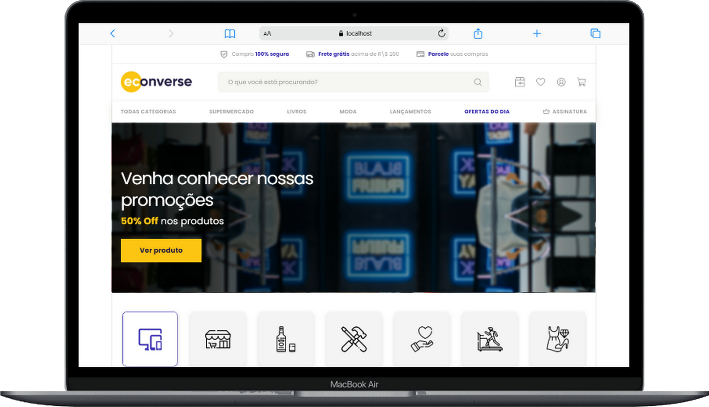
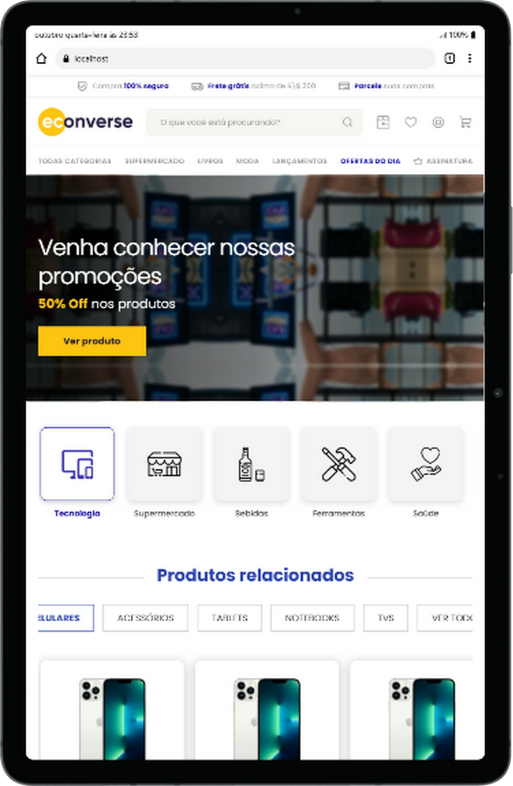
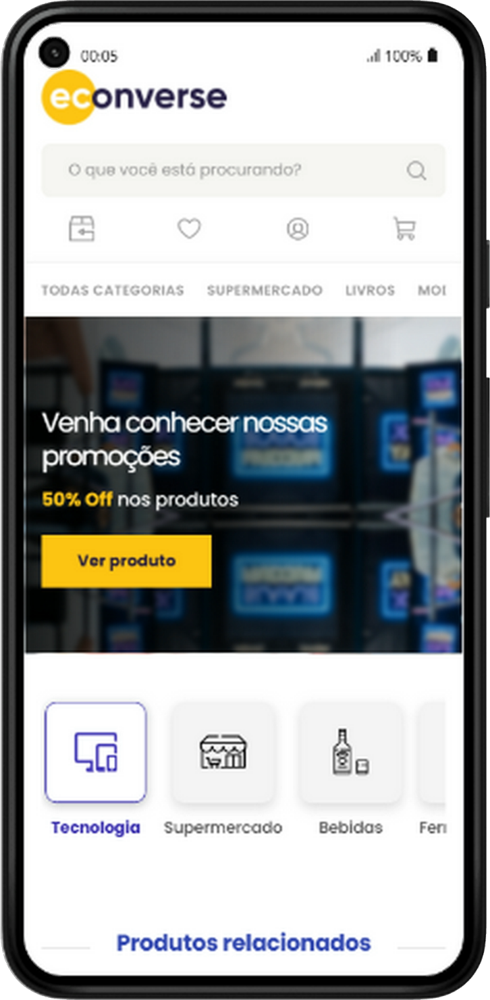
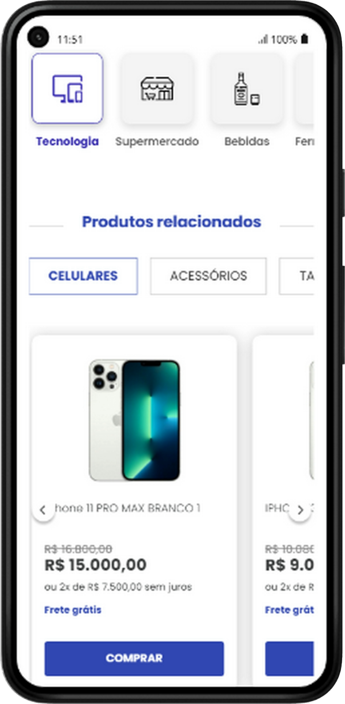
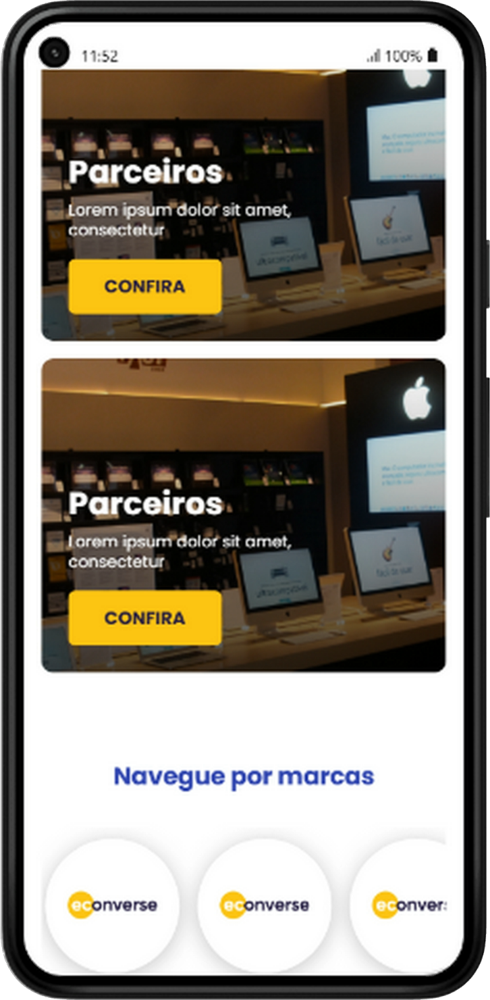

# 🛒 Desafio Técnico Front-End — Econverse (React + TypeScript)

Aplicação desenvolvida para o teste técnico da **Econverse**, focada na construção de um e-commerce responsivo, modular e de alto desempenho utilizando **React, TypeScript e SCSS Modules**.

---

## 🎥 Veja o Projeto em Ação!

Que tal dar uma olhada no projeto rodando ao vivo?
👉 [Desafio Econverse Front-End no ar (Vercel)](https://econverseag-frontend.vercel.app/)

- 🎨 **Figma de Referência:** [Layout Teste Front-End Jr](https://www.figma.com/file/rWnzPeoxgynuNPsJjV0VmV/Teste-Front-End-Jr?node-id=0%3A1)


<br>
<div align="center">
    
    
    
</div>
<br>
<div align="center">
    
    
    
    
</div>

---

## 🧠 Decisões Técnicas & Arquiteturais

### 1. Parametrização e Reutilização de Componentes (Princípio DRY)
Para evitar a duplicação de lógica e markup em seções repetidas da página, o componente `ProductShowcase` foi projetado com controle de renderização condicional via props:
- `showTabs`: Ativa ou oculta a barra de categorias da vitrine.
- `showSeeAll`: Alterna a exibição do gatilho visual "Ver todos".

### 2. Tratamento do Layout e Prevenção de Reflow
- **Trancamento da Caixa de Título:** Para lidar com descrições de produtos de comprimentos variáveis sem desalinhar os botões de ação na base dos cards, foi aplicada a limitação de 2 linhas via `line-clamp: 2` combinada a uma altura fixa de `38px`.
- **Cálculo Preciso da Prateleira:** Largura dos cards configurada dinamicamente com `calc((100% - 60px) / 4)`, garantindo que 4 cards completos sejam renderizados lado a lado no desktop sem cortes visuais.

### 3. Consumo de API e Contorno de CORS
- Isolamento do consumo de dados em um Custom Hook (`useProducts`).
- Configuração de reescrita de rotas (*Proxy*) para desenvolvimento e produção, evitando o bloqueio por política *Same-Origin* do navegador ao consultar os endpoints da Econverse.

---

## 💡 Funcionalidades Destaque

* **Consumo Real da API de Produtos:** Integração assíncrona consumindo o catálogo de produtos da Econverse com tratamento completo de estados de carregamento (`loading`) e erros via Custom Hook.

* **Vitrine Dinâmica & Carrossel Nativo:** Navegação deslizante suave com setas customizadas do Figma, permitindo alternar abas de categorias e visualizar exatamente 4 cards inteiros por linha sem cortes de layout.

* **Modal de Detalhes do Produto (`ProductModal`):** Interface interativa que exibe foto, valor formatado em `R$`, descrição curta do produto, seletor numérico de quantidade (`- 01 +`) e suporte total a acessibilidade (fechamento via tecla `ESC` ou clique no overlay semitransparente).

* **Newsletter & Rodapé Estruturado:** Formato de inscrição com validação de campos (Nome, E-mail e Checkbox de termos) e rodapé organizado em 3 faixas horizontais com redes sociais e links institucionais.

* **Design Responsivo:** Otimizado e adaptado para visualização em qualquer dispositivo, do desktop ao mobile.

---

## 🛠 Tecnologias Utilizadas

* **React 18 & Vite:** Estrutura de Single Page Application (SPA) leve, moderna e de alto desempenho.

* **TypeScript:** Tipagem estrita de contratos de dados (`Product`, `ProductsApiResponse`), garantindo previsibilidade e prevenindo erros de execução.

* **SCSS (Sass Modules):** Estilização modularizada com Sass, utilizando variáveis globais (`$color-blue-primary`, `$font-primary`), mixins flexíveis e CSS Modules para isolamento de escopo.

* **Vite Dev Proxy:** Configuração de servidor proxy interno em `vite.config.ts` para contornar restrições de CORS em ambiente de desenvolvimento local.

* **Git & GitHub:** Controle de versão rigoroso aplicando convenções de *Conventional Commits* e histórico de branches organizado.

---

## 🎯 Checklist de Requisitos do Teste Econverse

- [x] **React + TypeScript:** Tipagem estrita para dados de produto e respostas da API.
- [x] **SCSS (Sass Modules):** Estilização modularizada e escopada, sem vazamento de CSS global.
- [x] **Sem Bibliotecas de UI:** Carrossel e modais desenvolvidos com recursos nativos do React e SCSS.
- [x] **Fidelidade ao Figma:** Respeitadas cores, fontes, alinhamentos à esquerda e ativos visuais originais.
- [x] **HTML Semântico & Acessibilidade:** Uso de tags semânticas, suporte à tecla `ESC` no modal e bloqueio de propagação de eventos no backdrop.


---

## ⚙️ Como Rodar o Projeto (Localmente)

1. **Clone o repositório:**
   ```bash
   git clone https://github.com/miriaamaral/EconverseAG-FrontEnd.git
   ```
2. **Acesse a pasta do projeto:**
   ```bash
   cd EconverseAG-FrontEnd
   ```
3. **Instale as dependências:**
   ```bash
   npm install
   ```
4. **Execute o servidor de desenvolvimento:**
   ```bash
   npm run dev
   ```
5. **Acesse no seu navegador:** http://localhost:5173


---

## ✉️ Contato

Vamos nos conectar e construir algo incrível juntos!

* **LinkedIn:** [Miriã Amaral](https://www.linkedin.com/in/miriaamaralcs)
* **GitHub:** [miriaamaral](https://github.com/miriaamaral)
* **Email:** [miriaamaralcs@gmail.com](mailto:miriaamaralcs@gmail.com)
* **Discord:** [miriaamaralcustodiosantos](https://discord.com/channels/miriaamaralcustodiosantos)

---

<p align="center">Feito com ❤️ por Miriã Amaral</p> 
